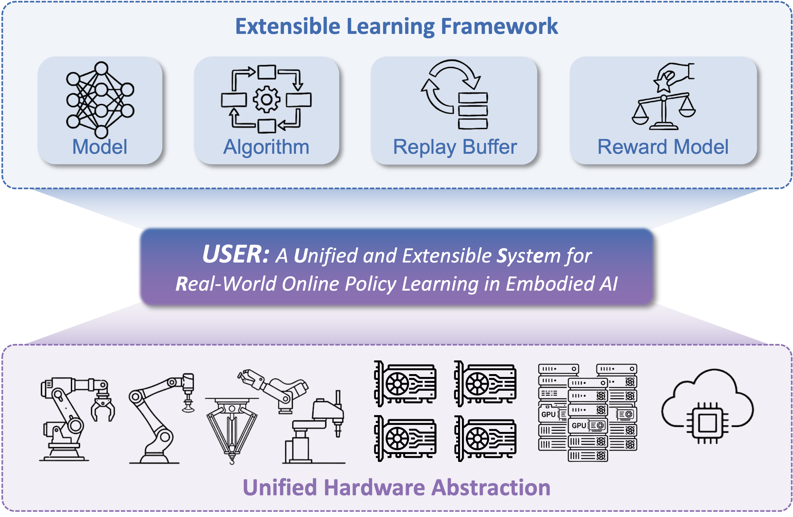

# Real-World RL with Franka

## 🚀 Overview




Welcome to the **USER**, a Unified and extensible SystEm for Real-world online policy learning. In this codebase, we provide extensible abstractions for rewards, algorithms, and policies, supporting online imitation or reinforcement learning of CNN/MLP, generative policies, and large vision–language–action (VLA) models within a unified pipeline.

## ⚙️Tasks

- **Peg-Insertion**: Aligning and inserting a peg into a hole.
- **Charger Task**: Plugging a charger into a socket.
- **Pick-and-Place**: Grasping and transporting a randomly initialized object (a rubber duck) to a target container.
- **Cap Tightening**: Rotating and tightening a bottle cap to a specified
torque or pose.
- **Table Clean-up**: Cleaning cluttered objects from the tabletop into a designated box, then close the lid.

## 🧠 Algorithms

We utilize a suite of RL components optimized for real-world efficiency:

* **SAC (Soft Actor-Critic)**: Classical algorithm in realworld RL.
* **RLPD (RL with Prior Data)**: Enhances learning efficiency by incorporating prior demonstration data with high update-to-data ratios.
* **SAC Flow**: Designed for sample-efficient flow-based policy RL.
* **HG-DAgger**: An interactive imitation learning algorithm.

---

## 🛠 Hardware Setup

| Component | Specification |
| --- | --- |
| **Robotic Arm** | Franka Emika Panda |
| **Cameras** | Intel RealSense (RGB support) |
| **Computing Unit** | RTX 4090 GPU (for CNN/Flow model), A100 * 4 (for $\pi_0$ model) |
| **Robot Controller** | NUC (w/o GPU) |
| **Space Mouse** | For teleoperation and human intervention |

---

## 📥 Installation

The setup is split between the **Controller Node** and **Training/Rollout Nodes**.

### 1. Robot Controller Node

* **Firmware**: Version `< 5.9.0` required (5.7.2 recommended).
* **OS**: Ubuntu 20.04 (required for ROS Noetic).
* **Real-time Kernel**: Recommended for performance. [Follow Franka Docs](https://frankarobotics.github.io/docs/libfranka/docs/real_time_kernel.html).

> ⚠️ **Warning**:
> If you have already installed ROS Noetic, libfranka, franka_ros and serl_franka_controllers manually, you can skip the installation of these packages by setting the environment variable export `SKIP_ROS=1` before running the installation script.  
> If you have skipped these installations, please make sure that you have sourced the ROS setup script (usually at `/opt/ros/noetic/setup.bash`), as well as the `franka_ros` and `serl_franka_controllers` setup scripts (usually at `<your_catkin_ws>/devel/setup.bash`) in your `~/.bashrc`. Also, make sure the libfranka shared library is in your `LD_LIBRARY_PATH` or installed in the system library path `/usr/lib`.  
> This is important every time before you start ray on the controller node to ensure that the Franka control packages can be correctly found.

```bash
# Into Repository
cd USER
bash requirements/install.sh embodied --env franka
source .venv/bin/activate
```

### 2. Training/Rollout Nodes

```bash
bash requirements/install.sh embodied --model openvla --env maniskill_libero
source .venv/bin/activate
```

---

## 🤖 Running the Experiment

### Step 1: Data Collection

Before training, collect initial demonstrations using a Space Mouse.

1. Configure `robot_ip` and `target_ee_pose` in `examples/embodiment/config/realworld_collect_data.yaml`.
2. Run `bash examples/embodiment/collect_data.sh`.

### Step 2: Cluster Setup

USER uses **Ray** for distributed management. You must set environment variables on every node:

```bash
export USER_NODE_RANK=<0 to N-1>
export PYTHONPATH=$PYTHONPATH:<path_to_USER>
# On Head Node
ray start --head --port=6379
# On Worker Nodes
ray start --address='<head_node_ip>:6379'
```

### Step 3: Launch Training

Execute the training script from the head node:

Example: **RLPD with single franka arm**:
```bash
bash examples/embodiment/run_realworld_async.sh realworld_peginsertion_rlpd_cnn_async
```

Example: **SAC with multi franka arm**:
```bash
bash examples/embodiment/run_realworld_async.sh realworld_peginsertion_rlpd_cnn_async_2arms
```

Example: **HG-DAgger with single franka arm**:
```bash
bash examples/embodiment/run_realworld_dagger_async.sh realworld_dagger_openpi_async
```

## 📊 Results & Visualization

Monitor your progress via **Tensorboard**: `tensorboard --logdir ./logs`.
